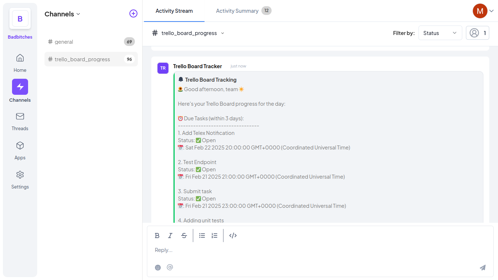

# Trello Board Tracker

This is a Telex integration that tracks a user's specified board and notifies the team on the card's progress every morning and evening.



## Key Features
- Receive your Trello Board progress on Telex
- Keep your team up-to date with the pending and updated tasks on the Trello boards

## Tech Stack
- Node
- Express
- Telex Webhooks
- Atlassian Trello API

## How to Setup the Integration in Telex.
1. Login or Create an account on [Telex](telex.im)
2. In your dashboard, navigate to the Apps section
3. Click on the "Add App" button and enter this "https://trello-board-tracker.onrender.com/integration.json" in the popup's input field.
4. Activate the app
5. To link to your Trello account by [Authorizing the app here](https://trello-board-tracker.onrender.com/trello/authorize).
6. After authorizing the app, copy the token and add it to your settings in the "Trello API Token" field.
7. Specify the boards you would like to track
8. Choose when the integration should run using the cron expression syntax then add it to the "Interval" field. For example, if you want to run the app at 9:15AM and 4:15PM, you'll use "15 9,16 * * *" 
* You can use [https://crontab.guru](https://crontab.guru) to generate an interval*
9. You can choose a channel to run the integration in the "Output tab"

## How to Setup and Run the App Locally
1. Clone the repository
```
git clone https://github.com/telexintegrations/trello-board-tracker
```
2. Install the dependencies
```
cd trello-board-tracker 
npm i
```
3. Run the Application
```
npm run dev
```
4. Run the tests
```
npm run test
```
5. Use Postman to test the endpoints

## API Documentation
`GET /trello/authorize`
Authorize the application to access your Trello account

Redirects to Trello for authorization then displays the user's token

`POST /tick`
Fetches the specified boards and their cards. Then sends a message to the specified channel on Telex

Request Body:
``` application/json
{
    "settings": [
        {
            "label": "Trello API token",
            "type": "text",
            "required": true,
            "default": "YOUR_TRELLO_TOKEN"
        },
        {
            "label": ""Which Trello board would you like to track?"",
            "type": "text",
            "required": true,
            "default": "YOUR_BOARD_1,YOUR_BOARD_2"
        }
    ]
}
```

Response(202):
``` application/json
{
    "status": 202,
    "description": "Data received successfully!"
}
```

Response(500):
``` application/json
{
    "status": 500,
    "description": "Failed to run service!"
}
```
